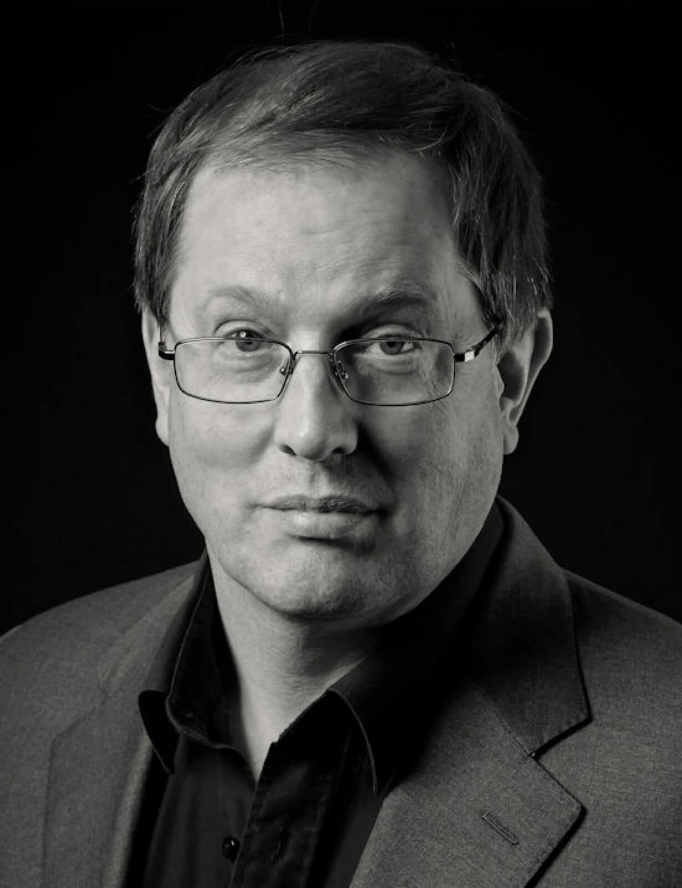

---
# You don't need to edit this file, it's empty on purpose.
# Edit theme's home layout instead if you wanna make some changes
# See: https://jekyllrb.com/docs/themes/#overriding-theme-defaults
layout: home
---
# William Godfree

William Godfree was born in London in 1954. He studied piano and composition at the Guildhall School of Music and Drama and for many years combined a career in teaching with a busy schedule of composition, conducting and performing. In 2009 he left the teaching profession to devote more time to his music.

Amongst his compositions are several suites for school orchestra, song-cycles, stage-musicals, and chamber works.

He plays with the jazz band Add Hock and performs in cabaret with Hampshire MP Michael Mates.